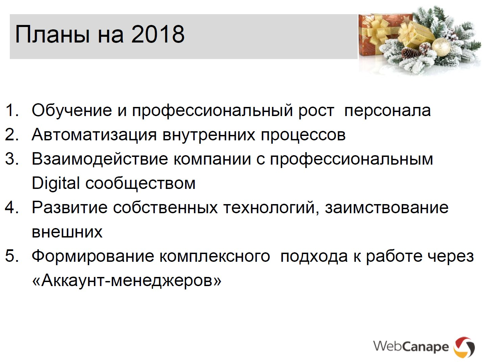

## Онлайн - система обучения и развития

---

### Планы компании 2018

1. Обучение и профессиональный рост персонала
2. Автоматизация внутренних процессов 
...
4. Развитие современных технологий, заимствование внешних

---

## Основная идея

Создание онлайн - портала для обучения сотрудников...
  и не только

---
## Предназначение
- Автоматизация ступеней развития сотрудников
- Создание личной программы обучения
- Tabtabus school в режиме <b>online</b>

---
### Автоматизация ступеней развития сотрудников

- автоматизировать обучение сотрудников
- контролировать знания
- помогает принимать решения о повышении
- контроль своих достижений самим сотрудником

---
### Возможные метрики

- twinstat
 - количество отработанных лет
 - количество закрытых задач
 - рентабильность задач
- kp
 - количество сданных проектов
 - рентабильность
 - выполнение плана по нынешней ступени развития
 
---
### Создание личной программы обучения

 - планирование своего обучения
 - добавлнение собственных ресурсов в систему
 - прохождение опубликованных курсов
 - получение достижений
---
### Создание личной программы обучения

---
### Tabtabus school в режиме <b>online</b>

 - создание полноценной платформы для размещения наших курсов
 - дополнительный источник знаний новых сотрудников

---
### Для компании

- автоматизация обучения
- проведение экзаменов на знание продуктов
- проведение экзаменов на повушение
- наглядная интерпретация ступеней роста
 - с указанием текущего прогресса по метрикам

